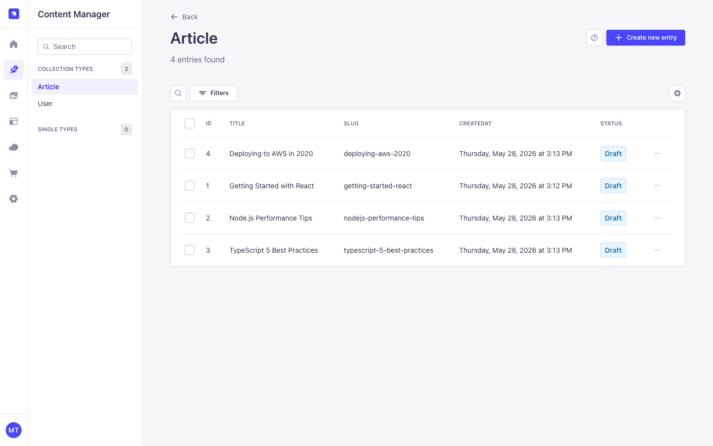
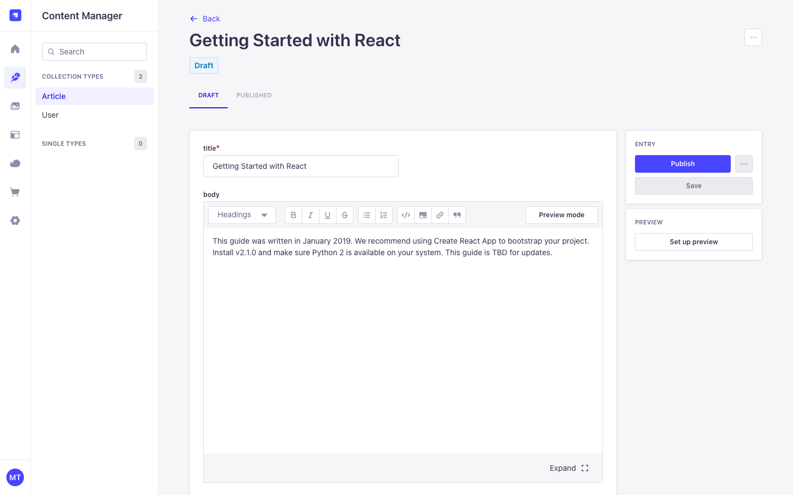
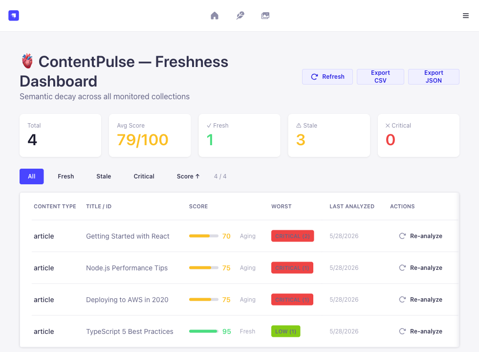

# 🫀 ContentPulse

**Semantic Decay & Freshness Engine — Multi-Platform Monorepo**

> Detect stale dates, outdated version strings, deprecated tech references, broken links, and rotting content — before your readers do. Works across every major CMS.

[](https://www.typescriptlang.org)
[](https://www.npmjs.com/package/@contentpulse/core)
[](https://www.npmjs.com/package/@contentpulse/payload)
[](LICENSE)

---

## Screenshots

**Strapi Content Manager** — articles monitored by the plugin:



**Article with stale content** — decay signals visible in the body:



**Strapi Freshness Dashboard** — real-time decay scores across all monitored collections:



**CLI — analyze any file:**

```
$ cpulse analyze getting-started-react.md

Score: 15/100  [Critical]
  ⚠  [date_decay]      Stale date: "January 2019" (7 year(s) ago)
  ⚠  [version_decay]   Version string "v2.1.0" — verify it's still current
  ⚠  [stale_reference] Contains placeholder: "TBD"
  ⚠  [tech_decay]      Create React App is officially deprecated (2023)
  ⚠  [tech_decay]      Python 2 is EOL since January 2020

$ cpulse analyze typescript-5-best-practices.md

Score: 100/100  [Fresh]
  ✓  No decay detected
```

---

## Packages

| Package | npm | Platform | Description |
|---|---|---|---|
| [`@contentpulse/core`](packages/core) | `npm i @contentpulse/core` | — | Shared analyzer engine (no platform deps) |
| [`@contentpulse/payload`](packages/payload) | `npm i @contentpulse/payload` | Payload CMS v3 | Plugin with lifecycle hooks + admin fields |
| [`@contentpulse/contentful`](packages/contentful) | `npm i @contentpulse/contentful` | Contentful | Sidebar app + Entry Field SDK integration |
| [`strapi-plugin-content-pulse`](https://github.com/mturac/contentpulse-strapi) | `npm i strapi-plugin-content-pulse` | Strapi v5 | Separate repo — webhook, cron, REST API, dashboard |

---

## Architecture

```
contentpulse/ (this repo)
├── packages/
│   ├── core/              ← @contentpulse/core
│   │   └── src/
│   │       ├── analyzer.ts       chrono-node + version + stale-ref + tech-decay + custom rules
│   │       ├── link-checker.ts   async broken-link detection (url_rot)
│   │       ├── types.ts          PulseWarning, AnalyzerConfig, scoring helpers
│   │       └── index.ts
│   │
│   ├── contentful/        ← @contentpulse/contentful
│   │   └── src/
│   │       ├── extractor.ts   Contentful rich-text → plain text
│   │       ├── adapter.ts     bridge to @contentpulse/core
│   │       ├── components/
│   │       │   └── PulseWidget.tsx
│   │       └── index.tsx
│   │
│   └── payload/           ← @contentpulse/payload
│       └── src/
│           ├── extractor.ts   Lexical JSON → plain text
│           └── index.ts       Plugin + afterChange hook

contentpulse-strapi/ (separate repo)
    github.com/mturac/contentpulse-strapi
    Strapi v5 — webhook, cron, dashboard, REST API, CSV/JSON export
```

---

## What It Detects

| Warning Type | Examples | Notes |
|---|---|---|
| `date_decay` | "Updated January 2022", "as of last year" | NLP date parsing via chrono-node |
| `version_decay` | "v3.2.1", "2023 edition" | Ignores IP addresses (192.168.x.x) |
| `stale_reference` | "deprecated", "coming soon", "TBD", "formerly" | Deduplicated — 10× same word = 1 warning |
| `tech_decay` | Create React App, Python 2, IE11, Flash, AngularJS v1, Moment.js, TSLint | 15+ EOL technologies tracked |
| `url_rot` | `https://old-site.com/404` | Async HEAD check, timeout-aware |

---

## Scoring

| Severity | Deduction | Trigger |
|---|---|---|
| **Critical** | −25 pts | > 3 years old / EOL tech |
| **High** | −15 pts | > 2 years old |
| **Medium** | −10 pts | > 1.5 years old |
| **Low** | −5 pts | Generic version string |

Range: `0` (fully decayed) → `100` (fresh). Score never goes below 0.

---

## Core Usage

Any adapter — or your own custom integration — can use `@contentpulse/core` directly:

```ts
import { analyzeTexts, getScoreColor, getScoreLabel } from '@contentpulse/core'

const result = analyzeTexts([
  { text: 'Updated January 2022. Requires Node.js v14.', field: 'body' },
  { text: 'Built with Create React App. Python 2 compatible.', field: 'intro' },
])

console.log(result.score)       // e.g. 30
console.log(getScoreLabel(30))  // "Critical"
console.log(getScoreColor(30))  // "#ef4444"
console.log(result.warnings)
// [
//   { type: 'date_decay', severity: 'critical', field: 'body',  message: 'Stale date: "January 2022"…' },
//   { type: 'tech_decay', severity: 'high',     field: 'body',  message: 'Node.js v14 is EOL…' },
//   { type: 'tech_decay', severity: 'high',     field: 'intro', message: 'Create React App is deprecated…' },
//   { type: 'tech_decay', severity: 'critical', field: 'intro', message: 'Python 2 is EOL since January 2020…' },
// ]
```

### Custom Decay Rules

Define your own patterns — domain changes, internal product renames, legacy phrases:

```ts
import { analyzeText } from '@contentpulse/core'

const result = analyzeText('Contact us at support@oldcompany.com', {
  customRules: [
    {
      pattern: 'oldcompany\\.com',
      message: 'Domain has changed — use newcompany.com',
      severity: 'high',
    },
    {
      pattern: 'v1\\.x',
      message: 'v1.x is no longer supported',
      severity: 'critical',
    },
  ],
})
```

### Locale-Aware Analysis

For multilingual setups, pass a BCP-47 locale to skip English-only detectors:

```ts
// Turkish content: skips date_decay (chrono-node is English-only)
// and tech_decay (English tech names won't match Turkish text)
const result = analyzeText('Bu içerik Ocak 2019 tarihlidir.', { locale: 'tr' })

// version_decay still runs for all locales — "v2.0.1" is universal
```

Supported: any non-`en` locale skips `date_decay` + `tech_decay`. `version_decay`, `stale_reference`, and `customRules` always run.

### Broken Link Detection

```ts
import { checkLinks } from '@contentpulse/core'

const results = await checkLinks(articleBody, {
  timeout: 5000,    // ms per request (default: 5000)
  concurrency: 5,   // parallel HEAD requests (default: 5)
})

// results[]: { url, status, ok, warning? }
// warning is a PulseWarning of type 'url_rot' when status >= 400 or request fails
```

---

## Payload CMS v3

```ts
// payload.config.ts
import { contentPulse } from '@contentpulse/payload'

export default buildConfig({
  plugins: [
    contentPulse({
      collections: ['posts', 'articles', 'docs'],
      warningThreshold: 80,
      maxAgeDays: 365,
    }),
  ],
})
```

Injects `_pulseScore`, `_pulseWarnings`, `_lastAnalyzedAt` into every monitored collection via `afterChange` hook.

---

## Contentful

Install the Contentful App via the marketplace or sideload in development. Displays a PulseWidget in the Entry sidebar showing:

- Circular score badge (0–100)
- Severity-filtered warning list
- Re-analyze button
- Per-warning type + suggestion

Config via App Parameters: `decayThresholdDays` (default: 365).

---

## Strapi v5

→ **[github.com/mturac/contentpulse-strapi](https://github.com/mturac/contentpulse-strapi)**

Full-featured standalone plugin:
- Webhook / Slack Block Kit notifications on decay
- Daily cron bulk re-analysis with batch processing
- Admin Freshness Dashboard with filters, sort, per-row re-analyze
- REST API: `/api/content-pulse/dashboard`, `/reanalyze/:uid/:id`
- **Export as CSV or JSON** — full audit trail download from dashboard

---

## Development

```bash
# Install all workspaces
npm install

# Run all tests (51 tests, 0 failures)
npm test

# Build all packages
npm run build

# Work on a specific package
npm run test:core
npm run test:payload
npm run test:contentful
```

---

## Test Coverage

```
packages/core — 51 tests passing
  ✓ analyzeText — clean content (3)
  ✓ date_decay — NLP parsing + severity ladder (4)
  ✓ version_decay — semver, IP exclusion, year editions (5)
  ✓ stale_reference — dedup, score floor (4)
  ✓ tech_decay — 8 EOL technologies + modern-tech exclusion (9)
  ✓ analyzeTexts — multi-field aggregation (3)
  ✓ metadata — analyzedAt ISO timestamp (1)
  ✓ calcScore / getScoreColor / getScoreLabel (8)
  ✓ custom rules — pattern match, dedup, severity (3)
  ✓ locale-aware — tr skips date/tech, runs version (4)
  ✓ extractUrls — http/https, dedup, punctuation strip (4)
```

---

## Roadmap

- [x] `url_rot` — broken link detection via async HEAD check
- [x] Custom decay rules — user-defined regex patterns with severity
- [x] Locale-aware analysis — skip English-only detectors for non-`en` content
- [x] npm publish config — all packages publish-ready
- [x] CSV/JSON export — audit trail download (Strapi plugin)
- [ ] Score history / trend tracking (rolling JSON window)
- [ ] Public freshness badge API
- [ ] Community-maintained tech decay dictionary

---

## License

MIT © [Mehmet Turac](https://github.com/mturac)
