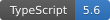

<div align="center">

# ContentPulse

**Semantic Decay & Freshness Engine for Headless CMS**





*Detect outdated content before your users do.*

**Supported Platforms:** [PayloadCMS v3](#payloadcms) · [Strapi v5](#strapi) · [Contentful](#contentful)

[English](#english) | [Français](#français) | [Türkçe](#türkçe)

</div>

---

<a name="english"></a>
## 🇬🇧 English

### Overview

ContentPulse is a PayloadCMS v3 plugin that automatically detects semantic decay in your content. It analyzes dates, version strings, and other temporal references to calculate a freshness score, helping you keep your content current and trustworthy.

### Features

- **Date Decay Detection** — Identifies outdated dates using `chrono-node` natural language parsing
- **Version String Detection** — Flags old version references (e.g., "v2.0.0", "2022 edition")
- **Freshness Score** — Calculates 0-100 score based on content age and decay severity
- **Admin UI Widget** — Sidebar widget showing real-time freshness metrics with color-coded warnings
- **Privacy-First** — All analysis runs locally, no external API calls

### Architecture

```
src/plugins/content-pulse/
├── index.ts                    # Plugin entry & PayloadCMS integration
├── types.ts                    # TypeScript interfaces
├── analyzer/
│   └── index.ts               # Core analysis engine
├── hooks/
│   └── analyzeContent.ts      # afterChange hook
├── ui/
│   └── PulseSidebarWidget/
│       ├── index.tsx           # Hidden fields definition
│       └── Component.tsx       # React sidebar component
└── __tests__/
    └── analyzer.test.ts       # Vitest test suite
```

### Installation

```bash
npm install contentpulse
```

### Configuration

```typescript
// payload.config.ts
import { buildConfig } from 'payload'
import { contentPulse } from './plugins/content-pulse'

export default buildConfig({
  collections: [
    {
      slug: 'posts',
      fields: [
        { name: 'title', type: 'text' },
        { name: 'content', type: 'richText' },
      ],
    },
  ],
  plugins: [
    contentPulse({
      collections: ['posts'],
      warningThreshold: 80,
      maxAgeDays: 365,
      analyzers: {
        dates: true,
        versions: true,
      },
    }),
  ],
})
```

### How It Works

1. **Content Analysis** — After each document save, extracts text from Lexical/RichText fields
2. **Decay Detection** — Uses `chrono-node` for dates and regex for version patterns
3. **Score Calculation** — Freshness score starts at 100, reduced per warning severity
4. **Admin Display** — Sidebar widget shows score, warnings, and suggestions

### Warning Types

| Type | Description | Example |
|------|-------------|---------|
| `date_decay` | Content references old dates | "Last updated in March 2020" |
| `version_decay` | Content references old versions | "Using version 2.0.0" |

### Severity Levels

| Severity | Score Impact | Condition |
|----------|--------------|-----------|
| 🔴 Critical | -25 | 3x older than `maxAgeDays` |
| 🟠 High | -15 | 2x older than `maxAgeDays` |
| 🟡 Medium | -10 | 1.5x older than `maxAgeDays` |
| 🟢 Low | -5 | Slightly over `maxAgeDays` |

### Testing

```bash
npm test
```

```
✓ extractTextFromRichText > should extract text from plain string
✓ extractTextFromRichText > should extract text from Lexical JSON structure
✓ extractTextFromRichText > should handle empty content
✓ extractTextFromRichText > should handle nested arrays
✓ analyzeContent > should return perfect score for empty content
✓ analyzeContent > should return perfect score for fresh content
✓ analyzeContent > should detect date decay for old dates
✓ analyzeContent > should detect version decay
✓ analyzeContent > should detect year-based version decay
✓ analyzeContent > should calculate lower score for multiple warnings
✓ analyzeContent > should handle content without text fields gracefully
✓ analyzeContent > should respect custom maxAgeDays config
✓ analyzeContent > should respect analyzer config flags
✓ analyzeContent > should clamp score between 0 and 100

Test Files  1 passed (1)
     Tests  14 passed (14)
```

### Privacy

ContentPulse is designed with privacy in mind:

- ✅ **No External APIs** — All analysis runs locally
- ✅ **No Data Collection** — Content never leaves your server
- ✅ **No Tracking** — No analytics or telemetry

### License

MIT

---

<a name="français"></a>
## 🇫🇷 Français

### Aperçu

ContentPulse est un plugin PayloadCMS v3 qui détecte automatiquement la dégradation sémantique de votre contenu. Il analyse les dates, les chaînes de version et autres références temporelles pour calculer un score de fraîcheur.

### Fonctionnalités

- **Détection de dégradation des dates** — Identifie les dates obsolètes avec `chrono-node`
- **Détection de chaînes de version** — Signale les anciennes références de version
- **Score de fraîcheur** — Calcule un score de 0 à 100
- **Widget Admin** — Widget latéral avec métriques en temps réel
- **Respect de la vie privée** — Toute l'analyse s'exécute localement

### Installation

```bash
npm install contentpulse
```

### Configuration

```typescript
import { contentPulse } from './plugins/content-pulse'

plugins: [
  contentPulse({
    collections: ['posts'],
    warningThreshold: 80,
    maxAgeDays: 365,
  }),
]
```

### Niveaux de sévérité

| Sévérité | Impact | Condition |
|----------|--------|-----------|
| 🔴 Critique | -25 | 3x plus ancien que `maxAgeDays` |
| 🟠 Élevé | -15 | 2x plus ancien que `maxAgeDays` |
| 🟡 Moyen | -10 | 1.5x plus ancien que `maxAgeDays` |
| 🟢 Faible | -5 | Légèrement au-dessus de `maxAgeDays` |

### Licence

MIT

---

<a name="türkçe"></a>
## 🇹🇷 Türkçe

### Genel Bakış

ContentPulse, içeriğinizdeki anlamsal bozulmayı otomatik olarak tespit eden bir PayloadCMS v3 eklentisidir. Tarihler, sürüm dizeleri ve diğer zamansal referansları analiz ederek bir tazelik puanı hesaplar.

### Özellikler

- **Tarih Bozulma Tespiti** — `chrono-node` ile eski tarihleri tespit eder
- **Sürüm Dizesi Tespiti** — Eski sürüm referanslarını işaretler
- **Tazelik Puanı** — İçerik yaşına ve bozulma şiddetine göre 0-100 puan hesaplar
- **Admin Widget** — Gerçek zamanlı tazelik metrikleri gösteren yan panel widget'ı
- **Gizlilik Odaklı** — Tüm analiz yerel olarak çalışır, harici API çağrısı yok

### Kurulum

```bash
npm install contentpulse
```

### Yapılandırma

```typescript
import { contentPulse } from './plugins/content-pulse'

plugins: [
  contentPulse({
    collections: ['posts'],
    warningThreshold: 80,
    maxAgeDays: 365,
  }),
]
```

### Önem Seviyeleri

| Seviye | Puan Etkisi | Koşul |
|--------|-------------|-------|
| 🔴 Kritik | -25 | `maxAgeDays`'den 3x daha eski |
| 🟠 Yüksek | -15 | `maxAgeDays`'den 2x daha eski |
| 🟡 Orta | -10 | `maxAgeDays`'den 1.5x daha eski |
| 🟢 Düşük | -5 | `maxAgeDays`'den biraz daha eski |

### Lisans

MIT

---

<div align="center">

**Made with ❤️ for the PayloadCMS community**

</div>
